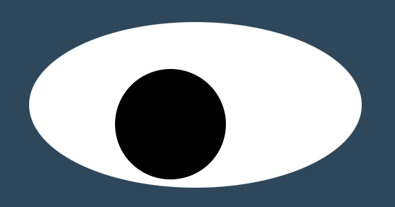

#  Eye Movement | Full Stack Bootcamp Project

 ***Try Demo:*** [https://codetracklift.github.io/eyemovement](https://codetracklift.github.io/eyemovement/) 

>**Skills Utilized**:
<ol>
    <li>Languages: HTML, CSS, JavaScript</li>
    <li>DOM Manipulation</li>
    <li>On Mouse Events</li>
    <li>On Touch Events</li>
    <li>Custom CSS Effects</li>
</ol>

## About
This was developed during Bootcamp Week 5. Starter code was supplied for one eye. 

>**Assignment Objectives**:
<ol>
    <li>Ensure the 'pupil' follows mouse movement to simulate 'eye movement'</li>
    <li>Add a second eye and ensure it follows mouse movement as well</li>
</ol>

>**Custom Features**:
<ol>
    <li>Added 'blink' effect for mouse and mobile inputs</li>
    <li>Added 'iris' image for a more realistic eye</li>
    <li>Custom CSS to add a head, hair, and mouth to go with the eyes</li>
    <li>Mouth also moves with mobile and mouse inputs</li>
    <li>Animated head will 'sleep' if mouse leaves the screen</li>
    <li>Custom CSS 'typewriter' message</li>
</ol>

## How to Run
This accepts mouse and mobile inputs.
>Mouse

- Eyes will follow mouse cursor position.  
- Eyes will blink and mouth will move with mouse click.
- Head will 'sleep' and 'typewriter' message is hidden if the mouse cursor leaves the browser window.

>Mobile

- Eyes will reposition upon touch input
- Eyes will blink and mouth will move with touch input

## Future Roadmap
- [x] Integrate mouse click event
- [x] Integrate touch events
- [x] Responsive web design
- [x] Mobile compatible
- [x] Custom styling
- [x] Typewriter message

This is a progression project, no further development is anticipated at this time.

## MIT License

Copyright (c) 2022 Pete Chu  ***[codeByPete](https://www.codebypete.com/)***

Permission is hereby granted, free of charge, to any person obtaining a copy
of this software and associated documentation files (the "Software"), to deal
in the Software without restriction, including without limitation the rights
to use, copy, modify, merge, publish, distribute, sublicense, and/or sell
copies of the Software, and to permit persons to whom the Software is
furnished to do so, subject to the following conditions:

The above copyright notice and this permission notice shall be included in all
copies or substantial portions of the Software.

THE SOFTWARE IS PROVIDED "AS IS", WITHOUT WARRANTY OF ANY KIND, EXPRESS OR
IMPLIED, INCLUDING BUT NOT LIMITED TO THE WARRANTIES OF MERCHANTABILITY,
FITNESS FOR A PARTICULAR PURPOSE AND NONINFRINGEMENT. IN NO EVENT SHALL THE
AUTHORS OR COPYRIGHT HOLDERS BE LIABLE FOR ANY CLAIM, DAMAGES OR OTHER
LIABILITY, WHETHER IN AN ACTION OF CONTRACT, TORT OR OTHERWISE, ARISING FROM,
OUT OF OR IN CONNECTION WITH THE SOFTWARE OR THE USE OR OTHER DEALINGS IN THE
SOFTWARE.